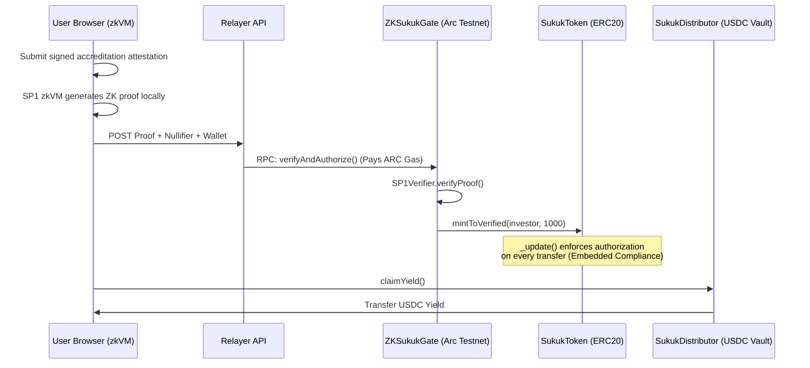

# Mizan

**Zero-knowledge compliance infrastructure for institutional Real World Assets on Arc.**

Mizan demonstrates how regulated assets can be tokenized, distributed, and traded while keeping investor identity and financial documents completely private.

Traditional RWA platforms solve compliance through centralized whitelists and custodial databases.

Mizan replaces this model with cryptographic compliance.

Investors prove eligibility using a Zero-Knowledge proof generated from a trusted accredited investor attestation. The Arc network verifies the proof without ever seeing the underlying document.

Once verified, investors receive a compliance-bound Sukuk token that can only move between authorized wallets.

Compliance is not a database entry.

It is enforced by the asset itself.

---

## The Problem

Tokenizing real-world assets is no longer the difficult part.

The challenge is maintaining institutional-grade compliance after issuance.

Traditional systems require:

- Storing investor documents
- Maintaining centralized KYC databases
- Trusting administrators to enforce transfer rules
- Allowing sensitive financial information to become a security liability

For regulated assets, onboarding compliance is not enough.

Secondary market transfers must remain compliant.

---

## The Solution

Mizan introduces a cryptographic compliance layer for tokenized assets.

The system combines:

- SP1 zkVM for privacy-preserving document verification
- Arc smart contracts for programmable compliance
- ZK-bound authorization for asset ownership
- USDC settlement for automated yield distribution

The blockchain only learns:

✓ A valid accreditation proof exists  
✓ The proof has not been reused  
✓ The wallet is authorized to hold the asset  

The blockchain never learns:

✗ Investor identity  
✗ Financial documents  
✗ Net worth information  
✗ Private accreditation data  

---

## Core Features

### Zero-Knowledge Investor Verification

Investors prove accreditation eligibility without revealing their documents.

SP1 zkVM verifies:

- Digital signatures
- Document authenticity
- Attestation validity
- Timestamp requirements

The result is compressed into a Groth16 proof verified directly on Arc.

---

### Compliance-Native Sukuk Token

Unlike a standard ERC20, Mizan tokens enforce compliance at the protocol level.

Every transfer checks:

- Sender authorization
- Recipient authorization

An unverified wallet cannot:

- Receive the asset
- Hold the asset
- Participate in the secondary market

Compliance is embedded directly into the token lifecycle.

```solidity
function _update(address from, address to, uint256 value) internal override {
    if (from != address(0)) require(authorized[from], "Sender not authorized");
    if (to != address(0)) require(authorized[to], "Recipient not authorized");
    super._update(from, to, value);
}
```

---

### On-Chain Verification Gate

`ZKSukukGate`

Responsible for:

- SP1 proof verification
- Nullifier replay protection
- Investor authorization
- Asset issuance
- Accreditation revocation

---

### USDC Yield Distribution

`SukukDistributor`

The asset manager deposits rental income into the distribution contract.

The contract:

- Tracks investor ownership
- Calculates proportional yield
- Allows investors to claim USDC payouts

---

## Architecture



---

## Circle & Arc Integration

Mizan uses Arc as the settlement layer for regulated RWAs.

Circle infrastructure enables:

- USDC-based yield settlement
- Institutional wallet onboarding through Programmable Wallets
- Future cross-chain treasury movement through CCTP

A future deployment could allow global rental income to flow across chains through CCTP before being distributed to verified Sukuk holders on Arc.

---

## Demo Flow

1. Investor connects wallet
2. Investor submits accreditation proof
3. Relayer submits verification transaction
4. Arc verifies SP1 proof
5. Wallet becomes authorized
6. Sukuk tokens are minted
7. Transfer restrictions enforce compliance
8. Asset manager deposits USDC yield
9. Investor claims payout

---

## Hackathon Demo Notes

The frontend demonstrates the complete verification workflow using a pre-generated SP1 proof.

The following components execute on Arc Testnet:

- SP1 proof verification
- Nullifier replay protection
- Investor authorization
- Compliance-bound ERC20 transfers
- USDC yield distribution

Production improvements would include:

- Live SP1 proof generation
- Wallet-bound proof commitments
- Production Circle Wallet integration
- Cross-chain USDC treasury flows via CCTP

---

## Vision

Mizan moves RWA compliance from centralized permission lists to programmable cryptographic rules.

The future of institutional assets is not:

"Who approved this wallet?"

It is:

"Can this wallet mathematically prove it is allowed to participate?"

Built on Arc.
Powered by zero knowledge.
