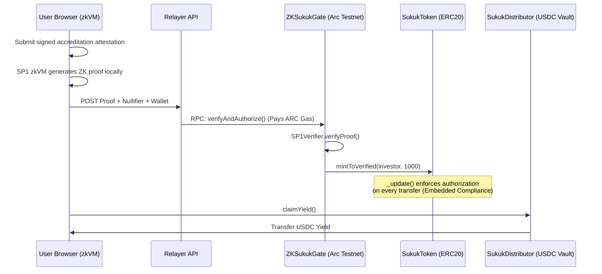

# Mizan

Privacy-preserving compliance infrastructure for tokenized Real World Assets on Arc.

Mizan demonstrates how institutional assets can be tokenized with native compliance enforcement.

Instead of storing investor identities in centralized databases, Mizan transforms accredited investor attestations into zero-knowledge proofs using SP1 zkVM.

The result:

- Investors prove eligibility without revealing financial documents.
- Arc verifies compliance on-chain.
- The asset itself enforces transfer restrictions.

Mizan moves compliance from a centralized whitelist into a cryptographic property of the token.

---

## The Problem

Tokenization has solved digital ownership.

It has not solved compliant ownership.

Institutional Real World Assets require investor eligibility verification, privacy protection, transfer restrictions, and regulatory controls.

Current approaches rely on centralized databases and administrator-managed allowlists. This creates a difficult tradeoff: transparency requires exposing information, privacy reduces verifiability.

Mizan removes this tradeoff by replacing identity-based compliance with cryptographic compliance.

The blockchain never learns who an investor is. It only verifies that the investor satisfies the required conditions.

---

## Core Innovation — Continuous Embedded Compliance

Most RWA platforms verify investors once, then rely on centralized permission lists.

Mizan embeds compliance directly into the asset.

The `SukukToken` ERC20 implements authorization checks at the transfer layer. Every transfer verifies sender and receiver authorization. If either wallet has not passed verification, the transfer fails.

```solidity
function _update(address from, address to, uint256 value) internal override {
    if (from != address(0)) require(authorized[from], "Sender not authorized");
    if (to != address(0)) require(authorized[to], "Recipient not authorized");
    super._update(from, to, value);
}
```

- ✓ Unauthorized wallets cannot receive tokens
- ✓ Secondary transfers remain compliant
- ✓ No centralized whitelist operator controls ownership
- ✓ Compliance rules travel with the asset

The token itself becomes compliance-aware.

---

## Architecture



### ZKSukukGate.sol

The compliance verification layer.

- Verifies SP1 proofs through the Arc verifier contract
- Prevents proof replay attacks using nullifiers
- Maintains authorized investor registry
- Mints compliant Sukuk tokens on successful verification
- Supports investor authorization revocation

### SukukToken.sol

The compliance-aware RWA token.

Unlike a standard ERC20, only verified investors can hold or transfer tokens. Secondary market movement remains compliant without any administrator intervention.

### SukukDistributor.sol

The yield distribution layer. Asset managers deposit USDC rental proceeds. Investors claim proportional yield based on their Sukuk holdings.

---

## Privacy Model

The blockchain does not store identity information, financial statements, accreditation documents, or CPA letters.

The blockchain only verifies:

- The proof is valid
- The proof has not been used before
- The wallet is authorized

---

## Circle & Arc Integration

Mizan is built on Arc Testnet with USDC-based settlement.

The architecture is designed for Circle Programmable Wallets (institutional onboarding without requiring users to manage traditional crypto wallets) and Circle CCTP (cross-chain USDC settlement infrastructure for multi-chain rental yield collection).

---

## Smart Contracts (Arc Testnet)

| Contract | Address |
|---|---|
| ZKSukukGate | `0xbE3EE75542E52879A451C38b7474706E367941cd` |
| SukukToken | `0xdf80e7e8dE2C8A15959009A51D052aEE9554875d` |
| SukukDistributor | `0xc577F43f0Aa7595F680e1986F077253Da24c3F23` |
| SP1 Verifier | `0x79052214591e45D1dfcC9AcAaf9f2dC853410Fe1` |

---

## Local Development

```bash
git clone https://github.com/Olalolo22/Mizan.git
cd Mizan/frontend
npm install
npm run dev
```

---

## Hackathon Demo Notes

For the prototype:

- The frontend demonstrates proof submission using a generated SP1 proof artifact.
- SP1 verification, authorization logic, nullifier protection, transfer restrictions, and yield distribution are designed to execute on Arc Testnet.
- Wallet binding inside the ZK circuit is simplified for demonstration purposes.

---

## Future Work

- Fully live SP1 proof generation pipeline
- Wallet-bound proof generation
- Jurisdiction-aware compliance policies
- Circle Programmable Wallet production integration
- Cross-chain USDC treasury flows through CCTP
- Institutional asset onboarding framework

---

## Hackathon Track

**Best Real World Asset Tokenization on Arc with Embedded Compliance** — OKX × Arc × Circle Hackathon
