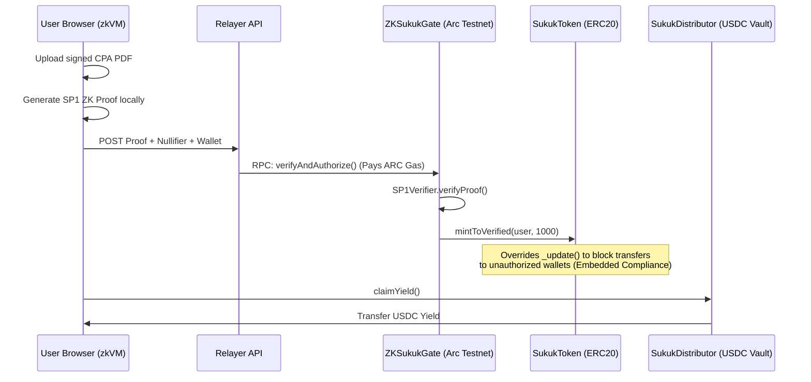

# Mizan — Zero-Knowledge Real World Assets

**Mizan** is a privacy-first infrastructure layer for tokenizing Real World Assets on the Arc EVM. 

By combining **Halal Finance** (Ijarah Sukuk) with **Zero-Knowledge Cryptography** (SP1 zkVM), Mizan solves a massive real-world privacy problem for high-net-worth individuals: achieving institutional-grade compliance without creating centralized honeypots of KYC documentation.


## 🏆 Hackathon Track
**Best Real World Asset Tokenization on Arc with Embedded Compliance**

## 🛑 The Problem
Current compliant asset tokenization models force investors to upload sensitive documents (passports, CPA letters, net-worth attestations) to centralized databases. This creates a massive data liability and directly conflicts with the privacy expectations of high-net-worth investors, particularly in the GCC. 

## 💡 The Solution
Instead of whitelisting identity, Mizan whitelists *cryptographic attestations of identity*.

Investors upload a digitally signed CPA attestation letter (e.g., DocuSign) locally in their browser. Our architecture utilizes an SP1 zkVM program to parse the PDF, verify the RSA-SHA256 signature against trusted internet root certificates (DigiCert), and generate a zero-knowledge proof. 

The blockchain learns absolutely nothing about the user's identity, net worth, or origin. It only learns two things: the cryptographic math is valid, and a unique deterministic nullifier is recorded to prevent double-claiming. 

Once verified on Arc Testnet, the contract automatically mints a fractional Ijarah Sukuk token representing commercial real estate to the user. A companion smart contract automates USDC yield distribution to the verified token holders.

## 🏗️ Architecture



## 🔐 Institutional-Grade Embedded Compliance
Mizan goes beyond basic onboarding gates. We built **Continuous Embedded Compliance**:
1. **Zero-Knowledge Issuance**: Only mathematically proven wallets receive tokens.
2. **Transfer Restrictions**: The `SukukToken` overrides `_update()`. If an authorized wallet attempts to transfer tokens to an unauthorized wallet on the secondary market, the EVM natively rejects the transaction.
3. **Institutional Revocation**: The issuing institution can call `revokeAuthorization(wallet)` on the Gate contract. This instantly flips the local mapping, permanently freezing the user's ability to send or receive the asset.

## ⚙️ Tech Stack & Circle Integrations
* **Arc Testnet**: EVM execution environment for ZKSukukGate and token contracts.
* **SP1 zkVM**: Off-chain Rust-based proving environment for RSA-SHA256 signature validation.
* **Circle USDC**: The underlying asset yield (property rent) is denominated and distributed in USDC via the `SukukDistributor` smart contract.
* **Circle Programmable Wallets**: The UI integrates connection pathways for Enterprise Circle Wallets, designed to abstract away seed phrases and gas fees for retail Islamic finance investors.

## 💻 Local Development

```bash
# Clone repository
git clone https://github.com/Olalolo22/Mizan.git
cd Mizan/frontend

# Install dependencies
npm install

# Run the local frontend
npm run dev
```

*Note: The frontend mocks the heavy SP1 execution time via UI logs for demo speed, but interacts with live, deployed contracts on Arc Testnet.*

## 📄 Smart Contracts (Arc Testnet)
* **ZKSukukGate**: `0xbE3EE75542E52879A451C38b7474706E367941cd`
* **SukukToken**: `0xdf80e7e8dE2C8A15959009A51D052aEE9554875d`
* **SukukDistributor**: `0xc577F43f0Aa7595F680e1986F077253Da24c3F23`
* **SP1 Verifier**: `0x79052214591e45D1dfcC9AcAaf9f2dC853410Fe1`
